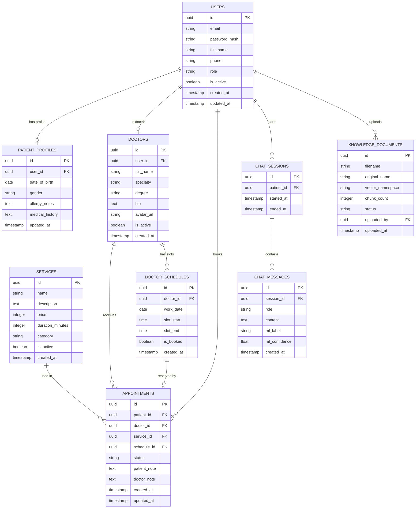

# Thiết kế Database
## Ứng dụng Phòng Khám Nha — AI Chatbot & Machine Learning

> **Phiên bản:** 1.0 &nbsp;|&nbsp; **DBMS:** PostgreSQL (Supabase) &nbsp;|&nbsp; **Cập nhật:** 2026

---

## Mục lục

1. [Tổng quan](#1-tổng-quan)
2. [Sơ đồ ERD](#2-sơ-đồ-erd)
3. [Chi tiết từng bảng](#3-chi-tiết-từng-bảng)
4. [Quan hệ giữa các bảng](#4-quan-hệ-giữa-các-bảng)
5. [Index & Tối ưu hiệu năng](#5-index--tối-ưu-hiệu-năng)
6. [Script SQL khởi tạo](#6-script-sql-khởi-tạo)

---

## 1. Tổng quan

### 1.1 Danh sách bảng

| STT | Tên bảng | Mô tả ngắn | Nhóm |
|---|---|---|---|
| 1 | `users` | Tài khoản hệ thống (bệnh nhân, bác sĩ, admin) | Auth |
| 2 | `patient_profiles` | Hồ sơ y tế mở rộng của bệnh nhân | Patient |
| 3 | `doctors` | Thông tin bác sĩ | Staff |
| 4 | `services` | Danh sách dịch vụ nha khoa và giá | Service |
| 5 | `doctor_schedules` | Lịch làm việc / slot trống của bác sĩ | Booking |
| 6 | `appointments` | Lịch hẹn đã đặt | Booking |
| 7 | `chat_sessions` | Phiên hội thoại với AI | Chat |
| 8 | `chat_messages` | Từng tin nhắn trong phiên chat | Chat |
| 9 | `knowledge_documents` | Tài liệu PDF đã upload vào Knowledge Base | AI/RAG |

### 1.2 Quy ước đặt tên

| Quy tắc | Ví dụ |
|---|---|
| Tên bảng: snake_case, số nhiều | `chat_messages`, `doctor_schedules` |
| Khóa chính: `id` kiểu `UUID` | `id UUID PRIMARY KEY DEFAULT gen_random_uuid()` |
| Khóa ngoại: `<tên_bảng>_id` | `patient_id`, `doctor_id` |
| Timestamp: luôn có `created_at`, `updated_at` | `created_at TIMESTAMPTZ DEFAULT NOW()` |
| Giá trị enum: dùng `TEXT` + `CHECK` constraint | `role TEXT CHECK (role IN ('patient','doctor','admin'))` |

---

## 2. Sơ đồ ERD



---

## 3. Chi tiết từng bảng

---

### 3.1 Bảng `users`

Lưu thông tin tài khoản của tất cả người dùng trong hệ thống.

| Cột | Kiểu dữ liệu | Ràng buộc | Mô tả |
|---|---|---|---|
| `id` | `UUID` | PK, DEFAULT gen_random_uuid() | Khóa chính |
| `email` | `TEXT` | NOT NULL, UNIQUE | Email đăng nhập |
| `password_hash` | `TEXT` | NULLABLE | Null nếu đăng nhập Google OAuth |
| `full_name` | `TEXT` | NOT NULL | Họ và tên đầy đủ |
| `phone` | `TEXT` | NULLABLE | Số điện thoại |
| `role` | `TEXT` | NOT NULL, CHECK | `patient` \| `doctor` \| `admin` |
| `is_active` | `BOOLEAN` | NOT NULL, DEFAULT true | Trạng thái tài khoản |
| `created_at` | `TIMESTAMPTZ` | NOT NULL, DEFAULT NOW() | Thời điểm tạo |
| `updated_at` | `TIMESTAMPTZ` | NOT NULL, DEFAULT NOW() | Thời điểm cập nhật cuối |

**Ghi chú:**
- `password_hash` là `NULL` với tài khoản đăng nhập bằng Google OAuth.
- `role = 'doctor'` sẽ có thêm bản ghi tương ứng trong bảng `doctors`.

---

### 3.2 Bảng `patient_profiles`

Lưu thông tin y tế mở rộng, chỉ dành riêng cho bệnh nhân.

| Cột | Kiểu dữ liệu | Ràng buộc | Mô tả |
|---|---|---|---|
| `id` | `UUID` | PK | Khóa chính |
| `user_id` | `UUID` | FK → users.id, UNIQUE | Quan hệ 1-1 với users |
| `date_of_birth` | `DATE` | NULLABLE | Ngày sinh |
| `gender` | `TEXT` | NULLABLE, CHECK | `male` \| `female` \| `other` |
| `allergy_notes` | `TEXT` | NULLABLE | Tiền sử dị ứng thuốc |
| `medical_history` | `TEXT` | NULLABLE | Lịch sử bệnh lý liên quan |
| `updated_at` | `TIMESTAMPTZ` | NOT NULL, DEFAULT NOW() | Lần cập nhật cuối |

---

### 3.3 Bảng `doctors`

Thông tin chuyên môn của bác sĩ. Liên kết với `users` qua `user_id`.

| Cột | Kiểu dữ liệu | Ràng buộc | Mô tả |
|---|---|---|---|
| `id` | `UUID` | PK | Khóa chính |
| `user_id` | `UUID` | FK → users.id, UNIQUE | Liên kết tài khoản |
| `full_name` | `TEXT` | NOT NULL | Tên hiển thị (có thể khác users) |
| `specialty` | `TEXT` | NOT NULL | Chuyên khoa (VD: Nha tổng quát) |
| `degree` | `TEXT` | NULLABLE | Bằng cấp (VD: Thạc sĩ nha khoa) |
| `bio` | `TEXT` | NULLABLE | Giới thiệu ngắn |
| `avatar_url` | `TEXT` | NULLABLE | URL ảnh đại diện |
| `is_active` | `BOOLEAN` | NOT NULL, DEFAULT true | Đang nhận lịch hay không |
| `created_at` | `TIMESTAMPTZ` | NOT NULL, DEFAULT NOW() | Ngày thêm vào hệ thống |

---

### 3.4 Bảng `services`

Danh mục dịch vụ nha khoa mà phòng khám cung cấp.

| Cột | Kiểu dữ liệu | Ràng buộc | Mô tả |
|---|---|---|---|
| `id` | `UUID` | PK | Khóa chính |
| `name` | `TEXT` | NOT NULL | Tên dịch vụ (VD: Nhổ răng khôn) |
| `description` | `TEXT` | NULLABLE | Mô tả chi tiết |
| `price` | `INTEGER` | NOT NULL, CHECK > 0 | Giá (đơn vị: VNĐ) |
| `duration_minutes` | `INTEGER` | NOT NULL, DEFAULT 30 | Thời gian thực hiện (phút) |
| `category` | `TEXT` | NULLABLE | Nhóm dịch vụ (VD: Thẩm mỹ, Điều trị) |
| `is_active` | `BOOLEAN` | NOT NULL, DEFAULT true | Còn cung cấp hay không |
| `created_at` | `TIMESTAMPTZ` | NOT NULL, DEFAULT NOW() | Ngày thêm |

**Ví dụ dữ liệu:**

| name | price | duration_minutes | category |
|---|---|---|---|
| Khám tổng quát | 150,000 | 30 | Khám |
| Nhổ răng thường | 200,000 | 45 | Điều trị |
| Nhổ răng khôn | 500,000 | 60 | Điều trị |
| Trám răng composite | 350,000 | 45 | Điều trị |
| Tẩy trắng răng | 1,500,000 | 90 | Thẩm mỹ |
| Niềng răng mắc cài | 25,000,000 | — | Chỉnh nha |

---

### 3.5 Bảng `doctor_schedules`

Mỗi bản ghi là một **slot thời gian** của bác sĩ. Khi bệnh nhân đặt lịch thành công, `is_booked` chuyển thành `true`.

| Cột | Kiểu dữ liệu | Ràng buộc | Mô tả |
|---|---|---|---|
| `id` | `UUID` | PK | Khóa chính |
| `doctor_id` | `UUID` | FK → doctors.id | Bác sĩ phụ trách |
| `work_date` | `DATE` | NOT NULL | Ngày làm việc |
| `slot_start` | `TIME` | NOT NULL | Giờ bắt đầu slot |
| `slot_end` | `TIME` | NOT NULL | Giờ kết thúc slot |
| `is_booked` | `BOOLEAN` | NOT NULL, DEFAULT false | Đã có người đặt chưa |
| `created_at` | `TIMESTAMPTZ` | NOT NULL, DEFAULT NOW() | Ngày tạo slot |

**Ràng buộc bổ sung:**
```sql
UNIQUE (doctor_id, work_date, slot_start)  -- Không trùng slot cùng bác sĩ cùng ngày
CHECK (slot_end > slot_start)              -- Giờ kết thúc sau giờ bắt đầu
```

---

### 3.6 Bảng `appointments`

Lưu trữ lịch hẹn sau khi bệnh nhân đặt thành công.

| Cột | Kiểu dữ liệu | Ràng buộc | Mô tả |
|---|---|---|---|
| `id` | `UUID` | PK | Khóa chính |
| `patient_id` | `UUID` | FK → users.id | Bệnh nhân đặt lịch |
| `doctor_id` | `UUID` | FK → doctors.id | Bác sĩ phụ trách |
| `service_id` | `UUID` | FK → services.id | Dịch vụ chọn |
| `schedule_id` | `UUID` | FK → doctor_schedules.id, UNIQUE | Slot thời gian (1 slot = 1 lịch hẹn) |
| `status` | `TEXT` | NOT NULL, CHECK | Trạng thái lịch hẹn |
| `patient_note` | `TEXT` | NULLABLE | Ghi chú từ bệnh nhân |
| `doctor_note` | `TEXT` | NULLABLE | Ghi chú từ bác sĩ / admin |
| `created_at` | `TIMESTAMPTZ` | NOT NULL, DEFAULT NOW() | Thời điểm đặt |
| `updated_at` | `TIMESTAMPTZ` | NOT NULL, DEFAULT NOW() | Cập nhật cuối |

**Các trạng thái `status`:**

```
pending     → Chờ xác nhận (vừa đặt)
confirmed   → Admin/bác sĩ đã xác nhận
completed   → Đã khám xong
cancelled   → Đã hủy (bởi bệnh nhân hoặc phòng khám)
rescheduled → Đã dời lịch sang slot khác
```

---

### 3.7 Bảng `chat_sessions`

Mỗi lần bệnh nhân mở cửa sổ chat tạo ra một phiên mới.

| Cột | Kiểu dữ liệu | Ràng buộc | Mô tả |
|---|---|---|---|
| `id` | `UUID` | PK | Khóa chính |
| `patient_id` | `UUID` | FK → users.id | Bệnh nhân |
| `started_at` | `TIMESTAMPTZ` | NOT NULL, DEFAULT NOW() | Bắt đầu phiên |
| `ended_at` | `TIMESTAMPTZ` | NULLABLE | Kết thúc phiên (null = đang mở) |

---

### 3.8 Bảng `chat_messages`

Từng tin nhắn trong phiên chat, lưu cả kết quả ML để Admin xem lại.

| Cột | Kiểu dữ liệu | Ràng buộc | Mô tả |
|---|---|---|---|
| `id` | `UUID` | PK | Khóa chính |
| `session_id` | `UUID` | FK → chat_sessions.id | Thuộc phiên nào |
| `role` | `TEXT` | NOT NULL, CHECK | `user` \| `assistant` |
| `content` | `TEXT` | NOT NULL | Nội dung tin nhắn |
| `ml_label` | `TEXT` | NULLABLE | Nhãn phân loại ML (chỉ có ở tin user) |
| `ml_confidence` | `FLOAT` | NULLABLE | Độ tin cậy (0.0 – 1.0) |
| `created_at` | `TIMESTAMPTZ` | NOT NULL, DEFAULT NOW() | Thời điểm gửi |

**Ghi chú:**
- `ml_label` và `ml_confidence` chỉ có giá trị ở tin nhắn `role = 'user'`.
- Tin nhắn `role = 'assistant'` để hai trường này là `NULL`.
- Bác sĩ có thể tra cứu lại toàn bộ phiên chat qua `/admin/patients/:id/chats` để nắm tình trạng trước khi khám.

**Các giá trị `ml_label` hợp lệ:**

| Nhãn | Nhóm bệnh |
|---|---|
| `sau_rang` | Sâu răng |
| `viem_nuou` | Viêm nướu / nha chu |
| `e_buot` | Ê buốt / nhạy cảm ngà |
| `rang_khon` | Răng khôn |
| `chinh_nha` | Chỉnh nha / niềng răng |
| `tham_my` | Nha thẩm mỹ (tẩy trắng...) |
| `mat_rang` | Mất răng / cấy implant |
| `khac` | Không thuộc nhóm trên |

---

### 3.9 Bảng `knowledge_documents`

Theo dõi các tài liệu PDF mà Admin đã upload vào Knowledge Base của chatbot.

| Cột | Kiểu dữ liệu | Ràng buộc | Mô tả |
|---|---|---|---|
| `id` | `UUID` | PK | Khóa chính |
| `filename` | `TEXT` | NOT NULL | Tên file lưu trên server |
| `original_name` | `TEXT` | NOT NULL | Tên gốc khi upload |
| `vector_namespace` | `TEXT` | NOT NULL, UNIQUE | Namespace tương ứng trong Pinecone |
| `chunk_count` | `INTEGER` | NULLABLE | Số đoạn văn đã được embed |
| `status` | `TEXT` | NOT NULL, DEFAULT 'processing' | Trạng thái xử lý |
| `uploaded_by` | `UUID` | FK → users.id | Admin đã upload |
| `uploaded_at` | `TIMESTAMPTZ` | NOT NULL, DEFAULT NOW() | Thời điểm upload |

**Các trạng thái `status`:**
```
processing  → Đang chunk + embed
completed   → Đã lập chỉ mục xong, chatbot có thể dùng
failed      → Lỗi trong quá trình xử lý
```

---

## 4. Quan hệ giữa các bảng

```
users ──────────────────── 1:1 ──── patient_profiles
users ──────────────────── 1:1 ──── doctors
users ──────────────────── 1:N ──── appointments         (bệnh nhân đặt nhiều lịch)
users ──────────────────── 1:N ──── chat_sessions        (bệnh nhân có nhiều phiên chat)
users ──────────────────── 1:N ──── knowledge_documents  (admin upload nhiều tài liệu)

doctors ────────────────── 1:N ──── appointments         (bác sĩ nhận nhiều lịch hẹn)
doctors ────────────────── 1:N ──── doctor_schedules     (bác sĩ có nhiều slot)

services ───────────────── 1:N ──── appointments         (1 dịch vụ được dùng nhiều lần)

doctor_schedules ────────── 1:1 ──── appointments        (1 slot = 1 lịch hẹn tối đa)

chat_sessions ──────────── 1:N ──── chat_messages        (1 phiên có nhiều tin nhắn)
```

---

## 5. Index & Tối ưu hiệu năng

```sql
-- Tra cứu user nhanh theo email (login)
CREATE UNIQUE INDEX idx_users_email ON users(email);

-- Lọc lịch hẹn theo bệnh nhân và trạng thái
CREATE INDEX idx_appointments_patient_status ON appointments(patient_id, status);

-- Lịch hẹn theo bác sĩ và ngày (dashboard admin)
CREATE INDEX idx_schedules_doctor_date ON doctor_schedules(doctor_id, work_date);

-- Lịch hẹn chưa được đặt (query slot trống)
CREATE INDEX idx_schedules_available ON doctor_schedules(doctor_id, work_date)
  WHERE is_booked = false;

-- Lấy lịch sử chat của bệnh nhân
CREATE INDEX idx_chat_sessions_patient ON chat_sessions(patient_id);

-- Lấy tin nhắn theo phiên, sắp xếp thời gian
CREATE INDEX idx_chat_messages_session_time ON chat_messages(session_id, created_at);

-- Tra cứu bác sĩ đang hoạt động
CREATE INDEX idx_doctors_active ON doctors(is_active) WHERE is_active = true;
```

---

## 6. Script SQL khởi tạo

```sql
-- ============================================================
-- DATABASE INIT SCRIPT
-- Ứng dụng Phòng Khám Nha — AI Chatbot
-- ============================================================

-- Enable UUID generation
CREATE EXTENSION IF NOT EXISTS "pgcrypto";

-- ── 1. USERS ─────────────────────────────────────────────────
CREATE TABLE users (
    id            UUID        PRIMARY KEY DEFAULT gen_random_uuid(),
    email         TEXT        NOT NULL UNIQUE,
    password_hash TEXT,
    full_name     TEXT        NOT NULL,
    phone         TEXT,
    role          TEXT        NOT NULL CHECK (role IN ('patient', 'doctor', 'admin')),
    is_active     BOOLEAN     NOT NULL DEFAULT true,
    created_at    TIMESTAMPTZ NOT NULL DEFAULT NOW(),
    updated_at    TIMESTAMPTZ NOT NULL DEFAULT NOW()
);

-- ── 2. PATIENT PROFILES ──────────────────────────────────────
CREATE TABLE patient_profiles (
    id              UUID        PRIMARY KEY DEFAULT gen_random_uuid(),
    user_id         UUID        NOT NULL UNIQUE REFERENCES users(id) ON DELETE CASCADE,
    date_of_birth   DATE,
    gender          TEXT        CHECK (gender IN ('male', 'female', 'other')),
    allergy_notes   TEXT,
    medical_history TEXT,
    updated_at      TIMESTAMPTZ NOT NULL DEFAULT NOW()
);

-- ── 3. DOCTORS ───────────────────────────────────────────────
CREATE TABLE doctors (
    id          UUID        PRIMARY KEY DEFAULT gen_random_uuid(),
    user_id     UUID        UNIQUE REFERENCES users(id) ON DELETE SET NULL,
    full_name   TEXT        NOT NULL,
    specialty   TEXT        NOT NULL,
    degree      TEXT,
    bio         TEXT,
    avatar_url  TEXT,
    is_active   BOOLEAN     NOT NULL DEFAULT true,
    created_at  TIMESTAMPTZ NOT NULL DEFAULT NOW()
);

-- ── 4. SERVICES ──────────────────────────────────────────────
CREATE TABLE services (
    id               UUID        PRIMARY KEY DEFAULT gen_random_uuid(),
    name             TEXT        NOT NULL,
    description      TEXT,
    price            INTEGER     NOT NULL CHECK (price > 0),
    duration_minutes INTEGER     NOT NULL DEFAULT 30,
    category         TEXT,
    is_active        BOOLEAN     NOT NULL DEFAULT true,
    created_at       TIMESTAMPTZ NOT NULL DEFAULT NOW()
);

-- ── 5. DOCTOR SCHEDULES ──────────────────────────────────────
CREATE TABLE doctor_schedules (
    id          UUID        PRIMARY KEY DEFAULT gen_random_uuid(),
    doctor_id   UUID        NOT NULL REFERENCES doctors(id) ON DELETE CASCADE,
    work_date   DATE        NOT NULL,
    slot_start  TIME        NOT NULL,
    slot_end    TIME        NOT NULL,
    is_booked   BOOLEAN     NOT NULL DEFAULT false,
    created_at  TIMESTAMPTZ NOT NULL DEFAULT NOW(),
    UNIQUE (doctor_id, work_date, slot_start),
    CHECK (slot_end > slot_start)
);

-- ── 6. APPOINTMENTS ──────────────────────────────────────────
CREATE TABLE appointments (
    id            UUID        PRIMARY KEY DEFAULT gen_random_uuid(),
    patient_id    UUID        NOT NULL REFERENCES users(id),
    doctor_id     UUID        NOT NULL REFERENCES doctors(id),
    service_id    UUID        NOT NULL REFERENCES services(id),
    schedule_id   UUID        NOT NULL UNIQUE REFERENCES doctor_schedules(id),
    status        TEXT        NOT NULL DEFAULT 'pending'
                              CHECK (status IN ('pending','confirmed','completed','cancelled','rescheduled')),
    patient_note  TEXT,
    doctor_note   TEXT,
    created_at    TIMESTAMPTZ NOT NULL DEFAULT NOW(),
    updated_at    TIMESTAMPTZ NOT NULL DEFAULT NOW()
);

-- ── 7. CHAT SESSIONS ─────────────────────────────────────────
CREATE TABLE chat_sessions (
    id          UUID        PRIMARY KEY DEFAULT gen_random_uuid(),
    patient_id  UUID        NOT NULL REFERENCES users(id) ON DELETE CASCADE,
    started_at  TIMESTAMPTZ NOT NULL DEFAULT NOW(),
    ended_at    TIMESTAMPTZ
);

-- ── 8. CHAT MESSAGES ─────────────────────────────────────────
CREATE TABLE chat_messages (
    id             UUID        PRIMARY KEY DEFAULT gen_random_uuid(),
    session_id     UUID        NOT NULL REFERENCES chat_sessions(id) ON DELETE CASCADE,
    role           TEXT        NOT NULL CHECK (role IN ('user', 'assistant')),
    content        TEXT        NOT NULL,
    ml_label       TEXT,
    ml_confidence  FLOAT       CHECK (ml_confidence BETWEEN 0 AND 1),
    created_at     TIMESTAMPTZ NOT NULL DEFAULT NOW()
);

-- ── 9. KNOWLEDGE DOCUMENTS ───────────────────────────────────
CREATE TABLE knowledge_documents (
    id                UUID        PRIMARY KEY DEFAULT gen_random_uuid(),
    filename          TEXT        NOT NULL,
    original_name     TEXT        NOT NULL,
    vector_namespace  TEXT        NOT NULL UNIQUE,
    chunk_count       INTEGER,
    status            TEXT        NOT NULL DEFAULT 'processing'
                                  CHECK (status IN ('processing', 'completed', 'failed')),
    uploaded_by       UUID        REFERENCES users(id) ON DELETE SET NULL,
    uploaded_at       TIMESTAMPTZ NOT NULL DEFAULT NOW()
);

-- ── INDEXES ──────────────────────────────────────────────────
CREATE UNIQUE INDEX idx_users_email         ON users(email);
CREATE INDEX idx_appointments_patient       ON appointments(patient_id, status);
CREATE INDEX idx_schedules_doctor_date      ON doctor_schedules(doctor_id, work_date);
CREATE INDEX idx_schedules_available        ON doctor_schedules(doctor_id, work_date) WHERE is_booked = false;
CREATE INDEX idx_chat_sessions_patient      ON chat_sessions(patient_id);
CREATE INDEX idx_chat_messages_session_time ON chat_messages(session_id, created_at);
CREATE INDEX idx_doctors_active             ON doctors(is_active) WHERE is_active = true;

-- ── AUTO UPDATE updated_at ───────────────────────────────────
CREATE OR REPLACE FUNCTION trigger_set_updated_at()
RETURNS TRIGGER AS $$
BEGIN
  NEW.updated_at = NOW();
  RETURN NEW;
END;
$$ LANGUAGE plpgsql;

CREATE TRIGGER set_updated_at_users
  BEFORE UPDATE ON users
  FOR EACH ROW EXECUTE FUNCTION trigger_set_updated_at();

CREATE TRIGGER set_updated_at_appointments
  BEFORE UPDATE ON appointments
  FOR EACH ROW EXECUTE FUNCTION trigger_set_updated_at();

-- ── SEED DATA (dữ liệu mẫu để test) ─────────────────────────
INSERT INTO services (name, description, price, duration_minutes, category) VALUES
  ('Khám tổng quát',      'Khám và tư vấn tình trạng răng miệng',         150000,  30, 'Khám'),
  ('Nhổ răng thường',     'Nhổ răng sữa hoặc răng vĩnh viễn thông thường', 200000,  45, 'Điều trị'),
  ('Nhổ răng khôn',       'Phẫu thuật nhổ răng số 8',                      500000,  60, 'Điều trị'),
  ('Trám răng composite', 'Trám răng bằng vật liệu composite thẩm mỹ',     350000,  45, 'Điều trị'),
  ('Tẩy trắng răng',      'Tẩy trắng bằng đèn Laser/Zoom',               1500000,  90, 'Thẩm mỹ'),
  ('Cạo vôi răng',        'Lấy cao răng và đánh bóng',                     200000,  30, 'Điều trị');
```

---

*Tài liệu này mô tả schema phiên bản 1.0. Các bảng có thể được mở rộng thêm trong quá trình phát triển (ví dụ: bảng `prescriptions` cho đơn thuốc điện tử, `payments` cho thanh toán).*
