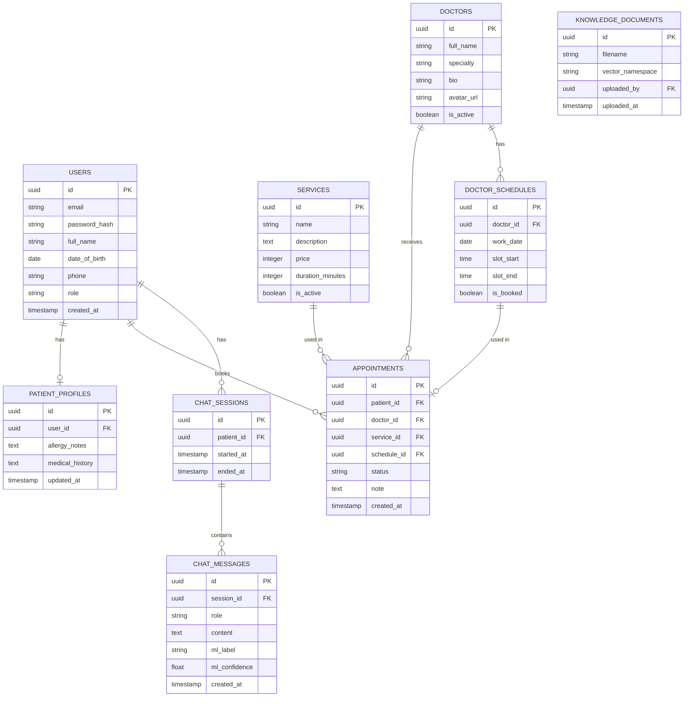
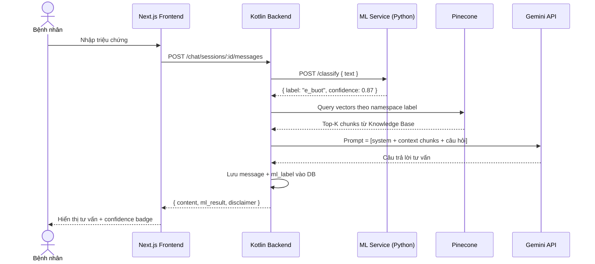
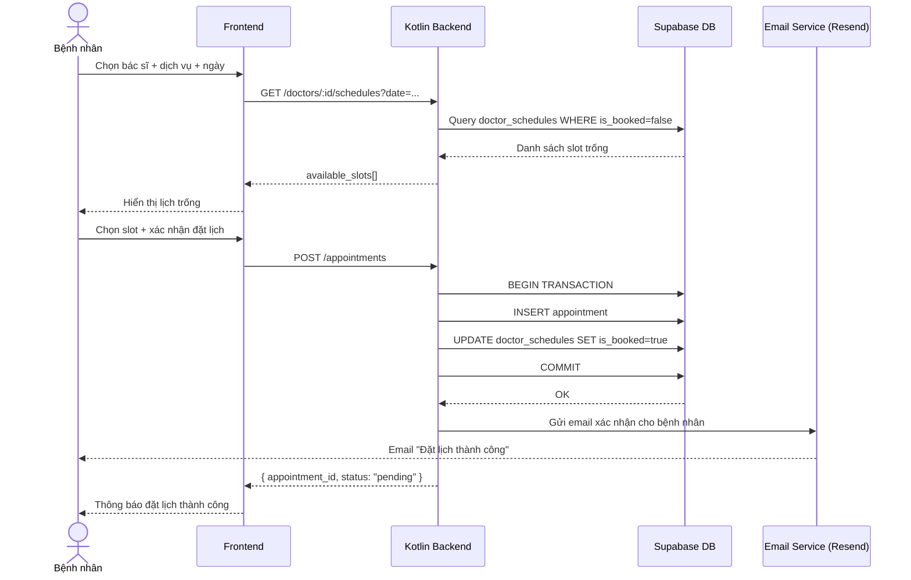
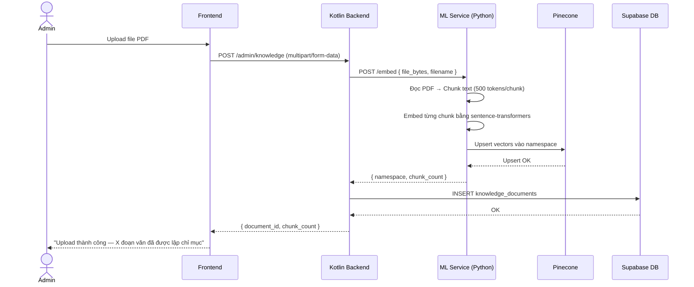
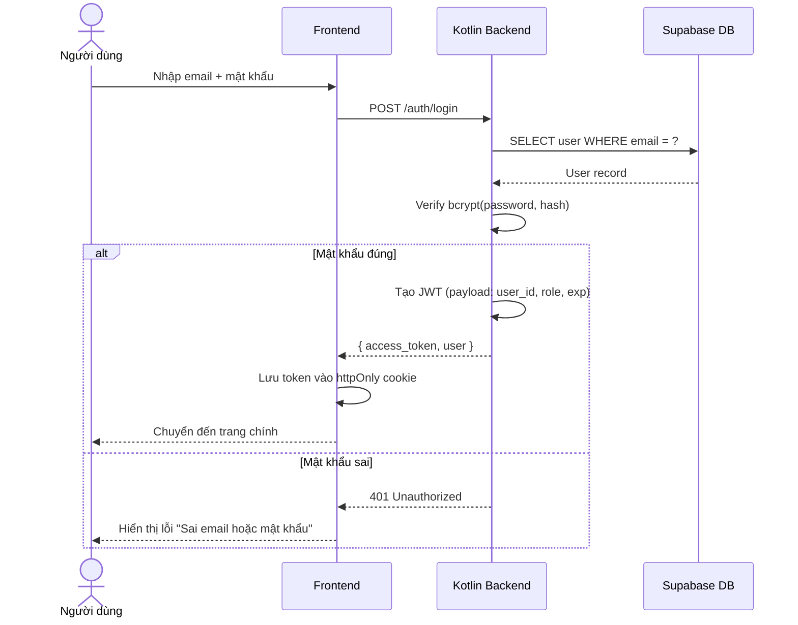

# Tài liệu Thiết kế Hệ thống
## Ứng dụng Phòng Khám Nha — AI Chatbot & Machine Learning

> **Phiên bản:** 1.0 &nbsp;|&nbsp; **Trạng thái:** Draft &nbsp;|&nbsp; **Cập nhật:** 2026

---

## Mục lục

1. [Kiến trúc hệ thống tổng thể](#1-kiến-trúc-hệ-thống-tổng-thể)
2. [ERD — Database Schema](#2-erd--database-schema)
3. [API Specification](#3-api-specification)
4. [Sequence Diagram — Luồng xử lý chính](#4-sequence-diagram--luồng-xử-lý-chính)

---

## 1. Kiến trúc hệ thống tổng thể

### 1.1 Mô tả tổng quan

Hệ thống được thiết kế theo mô hình **microservice nhẹ** gồm 3 service độc lập giao tiếp qua HTTP:

| Service | Công nghệ | Nhiệm vụ |
|---|---|---|
| **Backend chính** | Kotlin (Ktor) | Auth, Booking, quản lý dữ liệu, điều phối AI |
| **ML Service** | Python (FastAPI) | Phân loại triệu chứng tiếng Việt (PhoBERT/SVM) |
| **Frontend** | Next.js | Giao diện bệnh nhân và admin |

### 1.2 Sơ đồ kiến trúc

```
┌─────────────────────────────────────────────────────────────────┐
│                          CLIENT LAYER                           │
│                                                                 │
│   ┌──────────────────────────┐   ┌───────────────────────────┐  │
│   │   Patient Web App        │   │   Admin Dashboard         │  │
│   │   (Next.js)              │   │   (Next.js)               │  │
│   └────────────┬─────────────┘   └──────────────┬────────────┘  │
└────────────────┼─────────────────────────────────┼──────────────┘
                 │  HTTPS                          │  HTTPS
┌────────────────▼─────────────────────────────────▼──────────────┐
│                       BACKEND LAYER (Kotlin / Ktor)             │
│                                                                 │
│   ┌──────────┐  ┌──────────┐  ┌───────────┐  ┌─────────────┐   │
│   │  Auth    │  │ Booking  │  │  Patient  │  │  AI Router  │   │
│   │  Module  │  │  Module  │  │  Module   │  │   Module    │   │
│   └──────────┘  └──────────┘  └───────────┘  └──────┬──────┘   │
└─────────────────────────────────────────────────────┼──────────┘
          │ PostgreSQL              │ HTTP             │ HTTP
          ▼                        ▼                  ▼
┌──────────────────┐   ┌────────────────────┐  ┌─────────────────┐
│  Supabase DB     │   │  ML Service        │  │  Gemini API     │
│  (PostgreSQL)    │   │  (Python/FastAPI)  │  │  (Google AI)    │
│                  │   │  /classify         │  │                 │
│  - users         │   │  PhoBERT / SVM     │  │  RAG Context    │
│  - appointments  │   └────────────────────┘  └─────────────────┘
│  - chat_history  │
│  - doctors       │   ┌────────────────────┐
│  - services      │   │  Pinecone          │
└──────────────────┘   │  (Vector DB)       │
                       │  Knowledge Base    │
                       └────────────────────┘
```

### 1.3 Luồng dữ liệu tổng quát

```
Bệnh nhân nhập triệu chứng
        │
        ▼
Kotlin Backend nhận request
        │
        ├──► ML Service (Python)
        │         └── Phân loại nhãn bệnh + confidence score
        │
        ├──► Pinecone Vector DB
        │         └── Query theo nhãn → trả về context chunks từ KB
        │
        └──► Gemini API
                  └── Sinh câu trả lời dựa trên context + câu hỏi gốc
                            │
                            ▼
                  Trả kết quả về Frontend
```

---

## 2. ERD — Database Schema

### 2.1 Sơ đồ quan hệ



### 2.2 Mô tả bảng quan trọng

#### `users`
Lưu tất cả tài khoản hệ thống. Trường `role` nhận giá trị: `patient` | `doctor` | `admin`.

#### `chat_messages`
Mỗi tin nhắn lưu kèm `ml_label` và `ml_confidence` — kết quả từ ML Service — để Admin có thể xem lại bệnh nhân đã hỏi gì và AI đã phân loại thế nào trước khi khám.

#### `doctor_schedules`
Mỗi slot là một bản ghi riêng (ví dụ: 09:00–09:30). Khi bệnh nhân đặt, cột `is_booked` chuyển thành `true` để tránh đặt trùng.

#### `knowledge_documents`
Theo dõi các file PDF đã upload cho RAG. Trường `vector_namespace` là tên namespace trong Pinecone tương ứng với tài liệu đó.

---

## 3. API Specification

> Base URL: `https://api.nhakhoaapp.vn/v1`  
> Authentication: `Bearer <JWT_TOKEN>` trong header `Authorization`

### 3.1 Auth

| Method | Endpoint | Mô tả | Auth |
|---|---|---|---|
| `POST` | `/auth/register` | Đăng ký tài khoản mới | ❌ |
| `POST` | `/auth/login` | Đăng nhập, trả về JWT | ❌ |
| `POST` | `/auth/google` | OAuth với Google | ❌ |
| `POST` | `/auth/logout` | Hủy token | ✅ |
| `GET` | `/auth/me` | Lấy thông tin user hiện tại | ✅ |

**POST /auth/register — Request body:**
```json
{
  "email": "patient@example.com",
  "password": "SecurePass123",
  "full_name": "Nguyen Van A",
  "phone": "0901234567"
}
```

**POST /auth/login — Response:**
```json
{
  "access_token": "eyJhbGciOiJIUzI1NiIs...",
  "token_type": "Bearer",
  "expires_in": 86400,
  "user": {
    "id": "uuid",
    "email": "patient@example.com",
    "role": "patient"
  }
}
```

---

### 3.2 Patient Profile

| Method | Endpoint | Mô tả | Auth |
|---|---|---|---|
| `GET` | `/profile` | Xem hồ sơ cá nhân | ✅ Patient |
| `PUT` | `/profile` | Cập nhật hồ sơ + tiền sử dị ứng | ✅ Patient |

**PUT /profile — Request body:**
```json
{
  "full_name": "Nguyen Van A",
  "date_of_birth": "1995-06-15",
  "phone": "0901234567",
  "allergy_notes": "Dị ứng Penicillin",
  "medical_history": "Đã nhổ răng khôn năm 2022"
}
```

---

### 3.3 Chatbot AI

| Method | Endpoint | Mô tả | Auth |
|---|---|---|---|
| `POST` | `/chat/sessions` | Tạo phiên chat mới | ✅ Patient |
| `POST` | `/chat/sessions/:id/messages` | Gửi tin nhắn, nhận phản hồi AI | ✅ Patient |
| `GET` | `/chat/sessions` | Lấy danh sách phiên chat | ✅ Patient |
| `GET` | `/chat/sessions/:id/messages` | Lấy lịch sử tin nhắn | ✅ Patient |

**POST /chat/sessions/:id/messages — Request body:**
```json
{
  "content": "Răng tôi bị ê buốt khi uống đồ lạnh"
}
```

**POST /chat/sessions/:id/messages — Response:**
```json
{
  "message_id": "uuid",
  "role": "assistant",
  "content": "Triệu chứng ê buốt khi tiếp xúc nhiệt độ thấp thường liên quan đến...",
  "ml_result": {
    "label": "e_buot",
    "confidence": 0.87
  },
  "disclaimer": "Kết quả chỉ mang tính tham khảo. Vui lòng gặp bác sĩ để được tư vấn chính xác.",
  "created_at": "2026-03-26T10:30:00Z"
}
```

---

### 3.4 Booking

| Method | Endpoint | Mô tả | Auth |
|---|---|---|---|
| `GET` | `/doctors` | Danh sách bác sĩ | ✅ |
| `GET` | `/services` | Danh sách dịch vụ + giá | ✅ |
| `GET` | `/doctors/:id/schedules` | Lịch trống của bác sĩ theo ngày | ✅ |
| `POST` | `/appointments` | Đặt lịch khám | ✅ Patient |
| `GET` | `/appointments` | Lịch hẹn của bản thân | ✅ Patient |
| `DELETE` | `/appointments/:id` | Hủy lịch hẹn | ✅ Patient |

**GET /doctors/:id/schedules — Query params:**
```
?date=2026-04-01
```

**Response:**
```json
{
  "doctor_id": "uuid",
  "date": "2026-04-01",
  "available_slots": [
    { "schedule_id": "uuid", "start": "09:00", "end": "09:30" },
    { "schedule_id": "uuid", "start": "10:00", "end": "10:30" }
  ]
}
```

**POST /appointments — Request body:**
```json
{
  "doctor_id": "uuid",
  "service_id": "uuid",
  "schedule_id": "uuid",
  "note": "Bị ê buốt răng hàm dưới bên trái"
}
```

---

### 3.5 Admin APIs

| Method | Endpoint | Mô tả | Auth |
|---|---|---|---|
| `GET` | `/admin/appointments` | Tổng hợp lịch hẹn theo ngày/tuần | ✅ Admin |
| `PATCH` | `/admin/appointments/:id` | Xác nhận / hủy / dời lịch | ✅ Admin |
| `GET` | `/admin/patients/:id/chats` | Xem lịch sử chat AI của bệnh nhân | ✅ Admin |
| `POST` | `/admin/knowledge` | Upload PDF vào Knowledge Base | ✅ Admin |
| `GET` | `/admin/knowledge` | Danh sách tài liệu đã upload | ✅ Admin |
| `POST` | `/admin/doctors` | Thêm bác sĩ mới | ✅ Admin |
| `PUT` | `/admin/doctors/:id` | Cập nhật thông tin bác sĩ | ✅ Admin |
| `POST` | `/admin/services` | Thêm dịch vụ | ✅ Admin |

**PATCH /admin/appointments/:id — Request body:**
```json
{
  "status": "confirmed",
  "note": "Đã xác nhận qua điện thoại"
}
```
> `status` nhận một trong: `confirmed` | `cancelled` | `rescheduled`

---

### 3.6 ML Service (Internal)

> Chỉ gọi nội bộ từ Kotlin Backend. Không expose ra ngoài.

| Method | Endpoint | Mô tả |
|---|---|---|
| `POST` | `/classify` | Phân loại triệu chứng tiếng Việt |

**POST /classify — Request:**
```json
{
  "text": "Răng tôi bị ê buốt khi uống đồ lạnh"
}
```

**Response:**
```json
{
  "label": "e_buot",
  "confidence": 0.87,
  "top_labels": [
    { "label": "e_buot",    "confidence": 0.87 },
    { "label": "sau_rang",  "confidence": 0.09 },
    { "label": "viem_nuou", "confidence": 0.04 }
  ]
}
```

---

## 4. Sequence Diagram — Luồng xử lý chính

### 4.1 Luồng Chat AI (Core flow)



---

### 4.2 Luồng Đặt lịch khám



---

### 4.3 Luồng Admin Upload Knowledge Base



---

### 4.4 Luồng Đăng nhập (JWT Auth)



---

## 5. Ghi chú thiết kế

### Bảo mật
- Mật khẩu mã hóa bằng **bcrypt** (cost factor 12)
- JWT có thời hạn **24 giờ**, lưu trong `httpOnly cookie` (không accessible từ JS)
- Dữ liệu y tế bệnh nhân chỉ Admin/Doctor được đọc — kiểm tra `role` ở mọi endpoint nhạy cảm
- ML Service không expose ra internet, chỉ nhận request từ Backend nội bộ

### Xử lý đồng thời (Concurrency)
- Đặt lịch dùng **database transaction** để tránh 2 người đặt cùng slot
- Kotlin Coroutines xử lý song song gọi ML Service + query Pinecone trước khi tổng hợp gửi Gemini

### Disclaimer AI
- Mọi phản hồi từ chatbot **bắt buộc** kèm trường `disclaimer` trong response
- Frontend hiển thị badge cảnh báo rõ ràng cạnh mỗi tin nhắn AI

---

*Tài liệu này là overview phục vụ thuyết trình. Phiên bản chi tiết (bao gồm error codes, schema validation, rate limiting) sẽ được bổ sung trong quá trình phát triển.*
